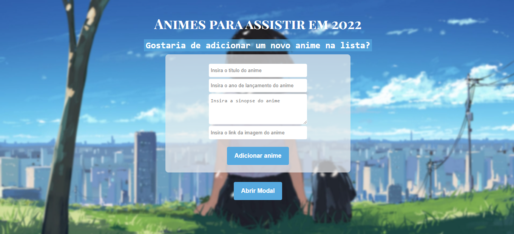
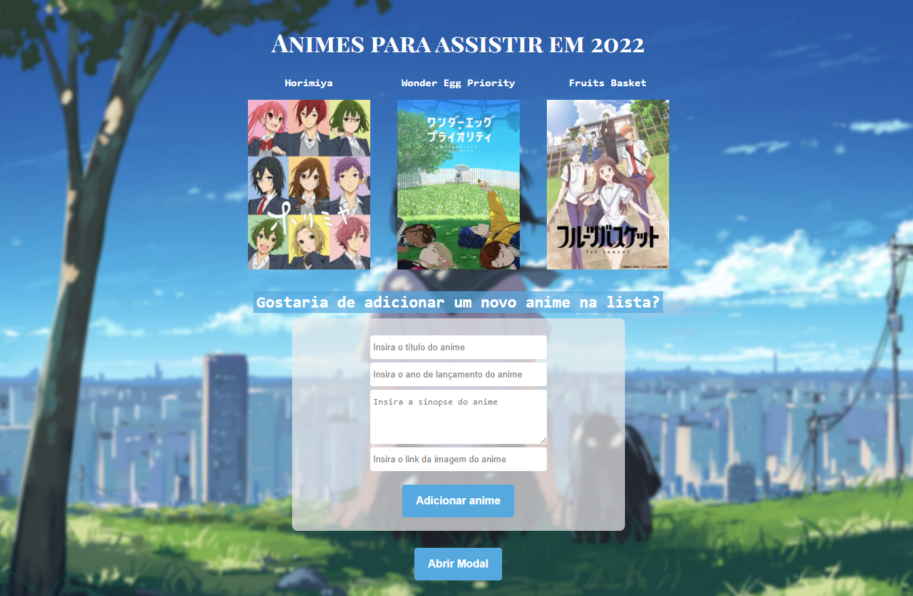
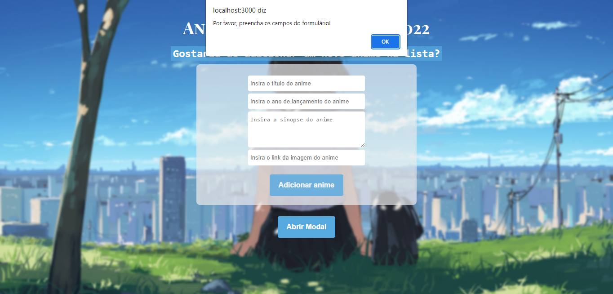
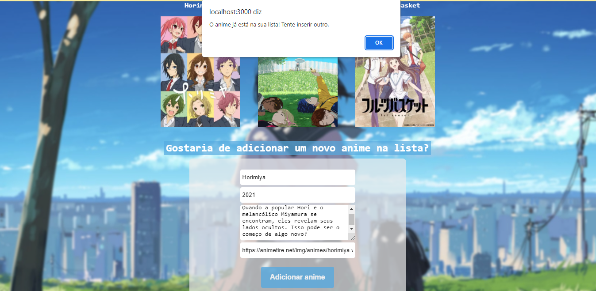
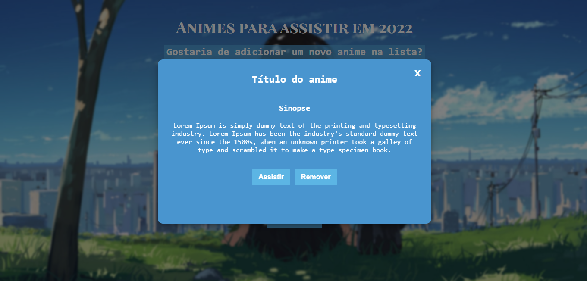

# Teste de Desenvolvimento Front-end
Aplicação para adicionar animes em uma lista através de um formulário e listar os animes adicionados pelo usuário. 
Criada utilizando a stack ReactJS.

## Como rodar a aplicação:
**Você deverá clonar o projeto e rodá-lo localmente seguindo os passos abaixo:**

1. `git clone https://github.com/inghuts/ListaAnimes.git` para clonar o projeto
2. `npm install` para instalar as dependências do projeto
3. `npm start`
4. Acessar [http://localhost:3000](http://localhost:3000) no navegador

## Telas do projeto

Lista de animes vazia.

Lista com três amostras de animes inseridos.

Ao clicar no botão de adicionar anime com os campos do formulário vazio, é disparado um alert informando que o usuário deve preencher os campos do formulário para adicionar um anime na lista.

Tentativa de inserir um anime que já está na lista, é disparado um alert informando que não há possibilidade de inserir um anime que já foi inserido.

Ao clicar no botão Abrir Modal, o modal da imagem é aberto. O objetivo era que ao clicar no anime da lista o modal seria aberto com as informações do anime e os botões de assistir e remover, o botão de assistir levaria para o site de um serviço de streaming para o usuário assistir o anime e o botão de remover removeria o anime da lista, porém não foi possível implementar essas funcionalidades completamente.